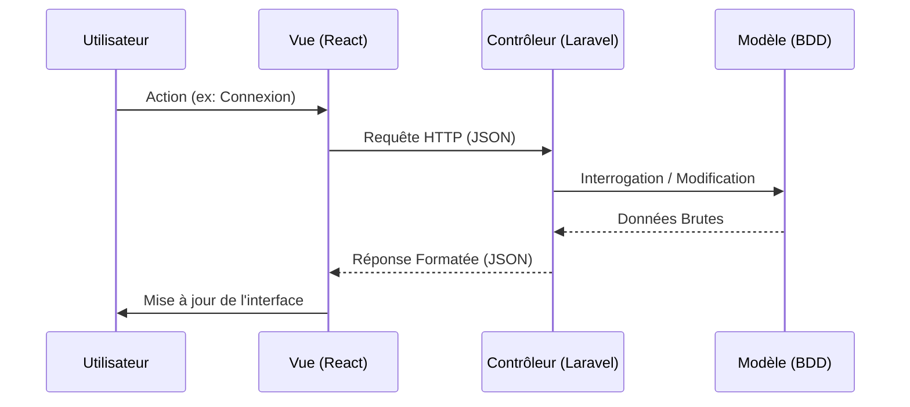

# 🎓 Plateforme Académique (Laravel + React)

Ce projet est une application web complète de gestion académique (Emploi du temps, Présences, Annonces) résultant de la fusion de trois modules (Modèle, Vue, Contrôleur). Il utilise **Laravel 11** pour le Backend (API) et **React 18** pour le Frontend (SPA).

## 🏗️ Architecture & Documentation

Le projet suit une architecture **MVC découplée** :

- **Modèle (Laravel)** : Structure des données et règles métier. [Voir la documentation Modèle](docs/README_MODEL.md)
- **Vue (React)** : Interface utilisateur dynamique. [Voir la documentation Vue](docs/README_VIEW.md)
- **Contrôleur (Laravel API)** : Logique de traitement et sécurité. [Voir la documentation Contrôleur](docs/README_CONTROLLER.md)

### Flux de Données



## 🚀 Fonctionnalités

- **Authentification Sécurisée** : Login/Register avec Laravel Sanctum et gestion des rôles (Admin, Enseignant, Étudiant).
- **Tableau de Bord** : Statistiques en temps réel (Nombre d'étudiants, cours, etc.).
- **Gestion Académique** :
  - **Emploi du temps** : Affichage dynamique des séances.
  - **Présences** : Suivi des absences.
  - **Annonces** : Communication ciblée par filière.

## 🛠️ Prérequis

- **PHP 8.2+**
- **Composer**
- **Node.js 18+** & **NPM**
- **SQLite** (ou autre SGBD configuré)

## 📦 Installation

1. **Cloner le projet**
   ```bash
   git clone <votre-repo>
   cd laravel_controller_project_folder
   ```

2. **Backend (Laravel)**
   ```bash
   composer install
   cp .env.example .env
   php artisan key:generate
   # Configuration de la base de données (SQLite par défaut)
   touch database/database.sqlite
   php artisan migrate:fresh --seed
   ```

3. **Frontend (React)**
   ```bash
   npm install
   npm run build # Pour la production, ou npm run dev pour le développement
   ```

## ▶️ Lancement

Pour lancer l'environnement de développement, ouvrez deux terminaux :

**Terminal 1 : Serveur API (Laravel)**
```bash
php artisan serve
```
*L'API sera accessible sur `http://127.0.0.1:8000`*

**Terminal 2 : Client Web (Vite/React)**
```bash
npm run dev
```
*L'application sera accessible sur `http://localhost:5173`*

## 🔑 Comptes de Test

La base de données est pré-remplie avec ces comptes (mot de passe : `password`) :

| Rôle | Email | Accès |
|------|-------|-------|
| **Admin** | `admin@ensa.ma` | Gestion globale, Statistiques |
| **Enseignant** | `prof@ensa.ma` | Gestion des cours (Simulé) |
| **Étudiant** | `etudiant@ensa.ma` | Consultation emploi du temps |

## 📂 Structure Simplifiée

```
/
├── app/                 # Logique Backend (Controllers, Models)
├── database/            # Migrations & Seeders
├── docs/                # Documentation détaillée (Model, View, Controller)
├── resources/
│   ├── js/              # Code Frontend (React)
│   │   ├── components/  # Composants réutilisables
│   │   ├── pages/       # Pages de l'application
│   │   └── Main.jsx     # Point d'entrée & Routing
│   └── views/           # Point d'entrée Blade (welcome.blade.php)
├── routes/              # Définition des routes API (api.php)
└── README.md            # Ce fichier
```

## 📝 Vérification de l'Intégration

1. **Connexion** : Connectez-vous avec `admin@ensa.ma`. Si le token est reçu et stocké, la liaison **Vue ↔ Contrôleur** fonctionne.
2. **Données** : Si les statistiques s'affichent sur le dashboard, la liaison **Contrôleur ↔ Modèle** fonctionne.
3. **Navigation** : Si vous pouvez naviguer sans rechargement de page, le routage **React** est opérationnel.
