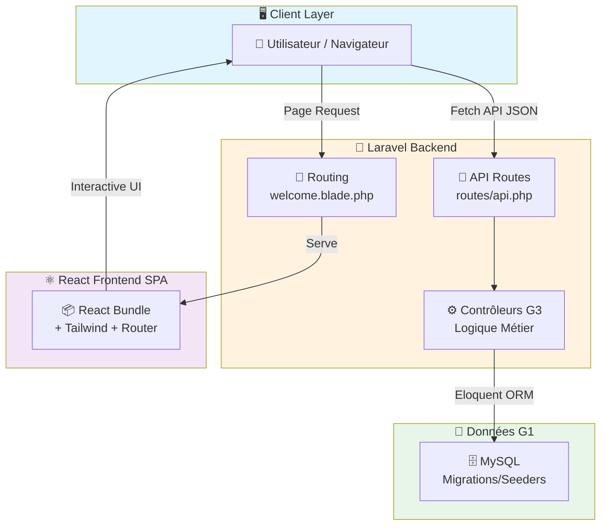

# 🎓 ENSA Smart Attendance - Rapport Technique & Architecture Unifiée

**Projet:** Système de Gestion de Présence  
**Version:** Sprint 3 (Validation Socle Backend & Intégration Frontend)  
**Stack Technique:** Laravel 11 (API) + React 18 (SPA) + MySQL  
**Responsabilité:** Groupe 3 (Contrôleurs & Orchestration)

## 📑 Sommaire

1. [Contexte & Défi Architectural](#1-contexte--défi-architectural)
2. [Stratégie d'Intégration : Le Monolithe Hybride](#2-stratégie-dintégration--le-monolithe-hybride)
3. [Focus Technique : Mécanique d'Intégration Laravel/React](#3-focus-technique--mécanique-dintégration-laravelreact-vite)
4. [Logique Métier & Performance](#4-logique-métier--performance-groupe-3)
5. [Structure des Données](#structure-des-données-groupe-1)
6. [Bilan d'Avancement & Roadmap Sprint 4](#bilan-davancement--roadmap-sprint-4)


## 1. Contexte & Défi Architectural

Dans le cadre du module "Développement Web Dynamique", le projet a été segmenté en trois pôles de compétences :

- **Groupe 1 (Modèle)** : Persistance des données et schéma relationnel (Migrations/Seeders)
- **Groupe 2 (Vue)** : UX et interface graphique via React
- **Groupe 3 (Contrôleur)** : Logique métier, routage et sécurisation

### Le Défi Critique : La Rupture Technologique

Comment fusionner une application Frontend moderne (React/SPA) avec un Backend robuste (Laravel) sans déployer deux serveurs distincts et gérer les problèmes de CORS ?

## 2. Stratégie d'Intégration : Le Monolithe Hybride

Laravel agit comme chef d'orchestre global, hébergeant le code Frontend tout en servant d'API. (To preview the following diagram, please use any mermaid-compatible viewer in VSCode extension.)



### 🧱 Backend - Laravel 11
**Rôle:** Socle de sécurité et API REST exposant des données au format JSON.

### 🎨 Frontend - React 18 + Tailwind
**Intégration:** SPA encapsulée dans `resources/js` de Laravel, offrant une navigation fluide sans rechargement.

### 🧠 Orchestration - Groupe 3
**Mission:** Pont vital entre la base de données (G1) et l'interface (G2) via validation et formatage JSON.

## 3. Focus Technique : Mécanique d'Intégration Laravel/React (Vite)

### A. Moteur de Compilation : Vite

Configuration `vite.config.js` :

```javascript
plugins: [
    laravel({
        input: ['resources/js/app.jsx'],
        refresh: true, // Hot Module Replacement (HMR)
    }),
    react(),
],
```

**Avantage HMR:** Les modifications React sont reflétées instantanément sans rechargement complet.

### B. Point d'Entrée Unique

Le fichier `welcome.blade.php` est la seule page HTML servie :

```html
<!DOCTYPE html>
<head>
    @viteReactRefresh
    @vite(['resources/js/app.jsx'])
</head>
<body>
    <div id="app"></div>
</body>
```

React prend le contrôle du DOM et gère le routing côté client via React Router.

### C. Flux de Données (API REST)

React effectue des appels asynchrones explicites vers les routes API. Format d'échange : **JSON uniquement**.

## 4. Logique Métier & Performance (Groupe 3)

### 🔗 Routage API (`routes/api.php`)

- `GET /api/seances/{id}` : Récupération d'une séance
- `POST /api/appel/save` : Validation des présences

### 📡 Optimisation : Eager Loading

**Problème:** N+1 Query Problem  
**Solution:** Utiliser `with()` d'Eloquent pour charger les relations en amont

```php
$seance = Seance::with('module')->findOrFail($id);
```

