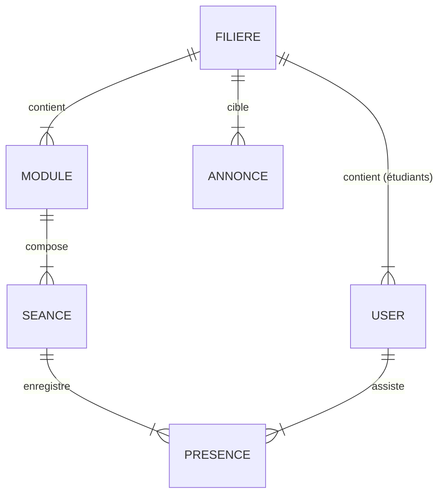

# 📘 Documentation Groupe MODÈLE (Model)

Ce document détaille l'architecture des données et la logique métier de la plateforme. Votre responsabilité est de garantir l'intégrité des données et de fournir une interface claire (Eloquent) pour le Contrôleur.

## 📂 Fichiers Clés

### 1. Modèles Eloquent (`app/Models/`)
Ce sont les classes PHP qui représentent les tables de la base de données.
*   **`User.php`** : Gère les utilisateurs (Admin, Prof, Étudiant).
    *   *Nouveauté* : Trait `HasApiTokens` pour l'auth, relation `belongsTo(Filiere)` pour les étudiants.
*   **`Filiere.php`** : Entité centrale (ex: G.INF, GTR).
    *   *Relations* : A plusieurs `users`, `modules`, `annonces`.
*   **`Module.php`** : Matière enseignée (ex: Algorithmique).
    *   *Relations* : Appartient à une `Filiere`, a plusieurs `seances`.
*   **`Seance.php`** : Un créneau de cours spécifique.
    *   *Relations* : Appartient à un `Module`, a plusieurs `presences`.
*   **`Presence.php`** : Table pivot enregistrant l'état (présent/absent) d'un étudiant à une séance.
*   **`Annonce.php`** : Communication. Peut être globale ou liée à une filière.

### 2. Base de Données (`database/`)
*   **Migrations** (`database/migrations/`) : Définition du schéma (création des tables).
    *   *Fichier clé* : `2025_12_27_000000_upgrade_database_schema.php` (Ajout des tables manquantes Filières/Annonces).
*   **Seeders** (`database/seeders/DatabaseSeeder.php`) : Population de la base avec des données de test réalistes (Admin, Profs, Étudiants, Cours).

## 🔗 Architecture & Relations (Schéma)

## 🤝 Interactions (Interface)

**Ce que vous fournissez :**
*   Des méthodes pour récupérer les données (ex: `Filiere::with('modules')->get()`).
*   Des méthodes pour créer/modifier des données (ex: `User::create(...)`).
*   La logique de validation des relations (ex: Un étudiant ne peut avoir de présence que pour une séance de sa filière).

**Ce que vous ignorez (Boîte Noire) :**
*   **La Vue** : Vous ne savez pas comment les données sont affichées (HTML/React).
*   **Le Contrôleur** : Vous ne savez pas quelle route HTTP a déclenché l'appel. Vous répondez simplement aux demandes de données du Contrôleur.
